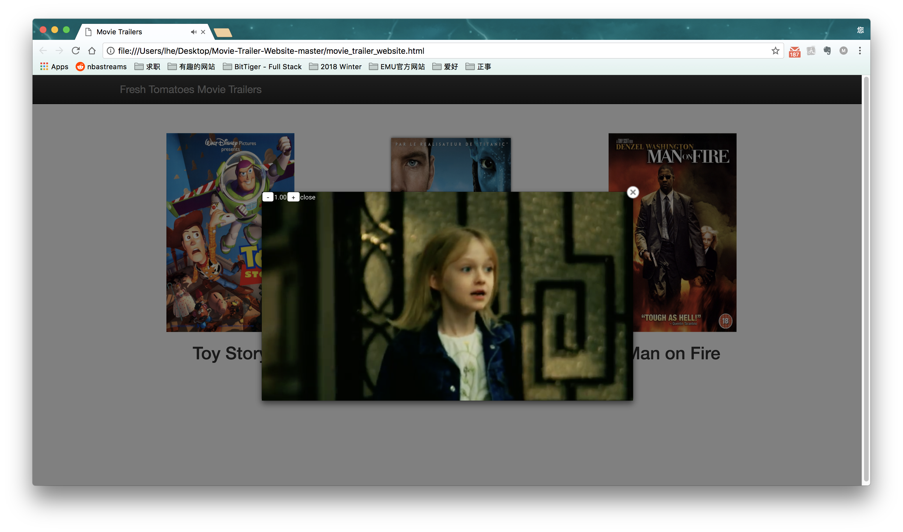

# README

## Intro

This python files will generate a website.
Which is a movie relevant website includes movie title, poster and trailer. 
Click on any of the posters will show the trailer video.

## How to Run the Code

1. Download the code or copy the repository.
2. Run entertainment_center.py:
  - **Using Terminal(Mac OS):** run Terminal -> using `cd ` go to the files' path -> run `python entertainment_center.py`
  - **Using IDLE:** Download IDLE from [Python](https://www.python.org/) -> open entertainment_center.py in IDLE -> Menu, Run
3. after step 2, there will be a website open in your browser as below, click any poster could show the trailer.
  

## License

MIT

[**Python Official License**](https://docs.python.org/3/license.html)
